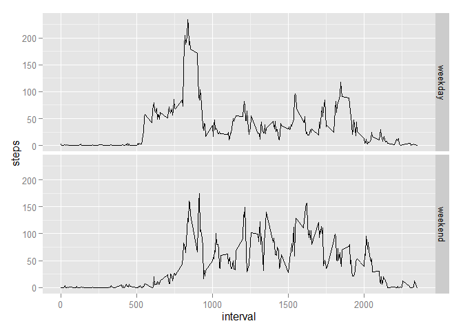

# Reproducible Research: Peer Assessment 1

#Introduction

It is now possible to collect a large amount of data about personal movement using activity monitoring devices such as a Fitbit, Nike Fuelband, or Jawbone Up. These type of devices are part of the "quantified self" movement -- a group of enthusiasts who take measurements about themselves regularly to improve their health, to find patterns in their behavior, or because they are tech geeks. But these data remain under-utilized both because the raw data are hard to obtain and there is a lack of statistical methods and software for processing and interpreting the data.

This assignment makes use of data from a personal activity monitoring device. This device collects data at 5 minute intervals through out the day. The data consists of two months of data from an anonymous individual collected during the months of October and November, 2012 and include the number of steps taken in 5 minute intervals each day.

## Data

The data for this assignment can be downloaded from the course web site:

Dataset: [Activity monitoring data][1]
The variables included in this dataset are:

**steps**: Number of steps taking in a 5-minute interval (missing values are coded as NA)

**date**: The date on which the measurement was taken in YYYY-MM-DD format

**interval**: Identifier for the 5-minute interval in which measurement was taken

The dataset is stored in a comma-separated-value (CSV) file and there are a total of 17,568 observations in this dataset.


## Loading and preprocessing the data

First, I want to load the package [dplyr][1] for data wrangling and the 
package [ggplot2][2] for making plotsand plyr, dplyr, tidyr for data wrangling. 
I will also set the option to remove scientific notation from the output and 
round decimals to 4 spaces.


```r
library(plyr)
library(dplyr)
```

```
## 
## Attaching package: 'dplyr'
## 
## The following objects are masked from 'package:plyr':
## 
##     arrange, count, desc, failwith, id, mutate, rename, summarise,
##     summarize
## 
## The following object is masked from 'package:stats':
## 
##     filter
## 
## The following objects are masked from 'package:base':
## 
##     intersect, setdiff, setequal, union
```

```r
library(ggplot2)
library(scales)
library(tidyr)
options(scipen=999)
```

Next, I'll load the activity.csv to a data.frame called "data."

```r
filename <- "activity.csv"
data <- read.csv(filename, stringsAsFactors = FALSE)
```
## What is mean total number of steps taken per day?

We want to find the total number of steps taken per day in order to calculate 
the mean, so I used *aggregate()* to sum the **steps** column for each unique **date.**

This is what the data looks like:


```r
stepsDay <- aggregate(steps ~ date, data = data, sum, na.action = na.omit)
qplot(steps, data=stepsDay, geom="histogram", binwidth = 500)
```

 

Now I can calculate the average number of steps per day:

```r
meanSteps <- mean(stepsDay$steps)
medianSteps <- median(stepsDay$steps)
```
Which gives me:

**Mean** steps per day: 10766.1886792

**Median** steps per day: 10765

## What is the average daily activity pattern?

If I want to know the average daily activity pattern I can *aggregate()* the **steps**
by the time **interval** and draw a linear plot.

```r
stepsTime <- aggregate(steps ~ interval, data = data, FUN=mean, na.action = na.omit)
TSplot <- plot(stepsTime$interval, stepsTime$steps, type = "l")
```

 

If I want to know the interval with the highest average number of steps I can
*subset* that out:


```r
highestInterval <- stepsTime[stepsTime$steps == max(stepsTime$steps), ]
```

I can clean up the output a bit by reformatting the interval's numeric value to 
a more familiar time format and putting the number of steps in it's own vector.


```r
maxInterval <- as.POSIXlt(strptime(as.character(paste("0", 
                highestInterval$interval, sep = "")), format= "%H%M"))
maxIntTime <- as.character(format(maxInterval, format = "%H:%M"))
highestIntervalSteps <- highestInterval[1, 2]
```
You can see that the interval with the highest value begins at 08:35
with an average of 206.2 steps.

## Imputing missing values

If you look at the data you can see that there are days with missing values

```r
head(data)
```

```
##   steps       date interval
## 1    NA 2012-10-01        0
## 2    NA 2012-10-01        5
## 3    NA 2012-10-01       10
## 4    NA 2012-10-01       15
## 5    NA 2012-10-01       20
## 6    NA 2012-10-01       25
```

In order to evaluate if these *missing values* (**NA**) bias the results of finding the mean
and median I will replace the **NA** values with the average number of steps for that
time interval across all of the days.


```r
impute.mean <- function(x) replace(x, is.na(x), mean(x, na.rm = TRUE))
compl.data <- ddply(data, ~interval, transform, steps = impute.mean(steps))
compl.data.arr <- arrange(compl.data, date)
```

Now that I've filled in the *missing values* lets see what the total number of 
steps per day looks like:


```r
stepsDayComp <- aggregate(steps ~ date, data = compl.data.arr, sum, na.action = na.omit)
qplot(steps, data=stepsDayComp, geom="histogram", binwidth = 500)
```

 

Now let's compare the new **mean** and **median** steps per day with the same calculations
from the data with the *missing values*


```r
meanStepsComp <- mean(stepsDayComp$steps)
medianStepsComp <- median(stepsDayComp$steps)
```

Here are the means: **missing values** - 10766.1886792 **no missing values** - 10766.1886792
You can see that substituting the mean value in for the missing values has no effect

Here are the medians: **missing values** - 10765 **no missing values** - 10766.1886792
You can see that substituting the mean value in for the missing values has a small effect on the median.  Intersting... 

## Are there differences in activity patterns between weekdays and weekends?

Lets take a look at the activity pattern again.  I wonder if there is a difference between
the test subject's activity during weekdays vs. weekends.  

Let's subset the data:

```r
data$date <- as.Date(data$date)
data.wd <- mutate(data, day = weekdays(date))
days <- unique(data.wd$day)
data.wd[data.wd$day %in% days[1:5], "wd"] <- "weekday"
data.wd[!(data.wd$day %in% days[1:5]), "wd"] <- "weekend"
```

Now we can aggregate the data labelled with the weekdays and weekends to 
calculate the mean

```r
stepsWD <- aggregate(steps ~ interval + wd, data = data.wd, FUN=mean, na.action = na.omit)
```


Let's take a look at those aggregations plotted:

```r
p <- ggplot(stepsWD, aes(interval,steps))+ geom_line() + facet_grid(wd ~ .)
p
```

 

The subject seems to start activity a little later in the day and be more active 
throughout the day with a smaller spike of activity in the morning.

[1]: https://d396qusza40orc.cloudfront.net/repdata%2Fdata%2Factivity.zip
[2]: http://cran.rstudio.com/web/packages/dplyr/vignettes/introduction.html
[3]: http://cran.r-project.org/web/packages/ggplot2/index.html
